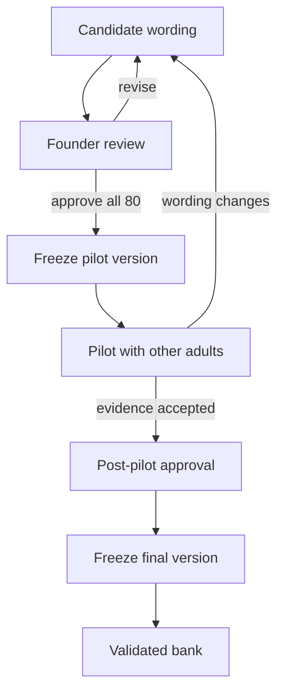

# Political literacy bank validation workflow v1

**Status:** Implemented validation gate; internal editorial pass complete; founder review pending
**Bank:** `literacy-master-2026.09-candidate-1`  
**Review:** `literacy-editorial-review-2026.09-1`  
**Audience:** English-speaking users aged 16+  

## What this checkpoint establishes

The 80 candidates have been read individually as questions for an ordinary adult, not as political-science exam prose. The internal pass checked whether a first-time reader can understand the task, distinguish the choices, and learn from the explanation without decoding specialist language.

This is an **editorial review**, not expert, cognitive or psychometric validation. All 80 records remain `candidate`; certified selection remains blocked.

## Internal outcome

| Outcome | Count | Meaning |
|---|---:|---|
| Ready for founder review | 80 | No blocking internal wording issue remains. This is not approval for certification. |
| Held | 0 | C36 was replaced rather than forcing a disputed classification. |
| Validated | 0 | No candidate may enter certified play yet. |

### Wording repaired in this pass

| Item | Problem found | Correction |
|---|---|---|
| C5 | Markets and welfare made social democracy as plausible as conservatism | Added inherited institutions, gradual reform and social duty as the deciding clues. |
| C24 | “Central power” did not clearly distinguish anarchism from libertarianism or federalism | Added state rule and imposed hierarchy while retaining voluntary association and mutual aid. |
| C34 | “Fair elections” was too imprecise for the electoral-democracy classification | Replaced it with meeting basic competitive-election standards and kept liberal safeguards separate. |
| C35 | “Bosses controlling workers” was colloquial and emotionally loaded | Replaced it with private control of workplaces. |
| C37 | Yes/no choices did not grammatically answer the prompt | Turned the prompt into an explicit yes/no identification question. |
| C38 | Supporting public railways did not necessarily mean supporting public ownership | Made public ownership explicit. |
| U9 | “Support for local decisions” was too loose | Connected the wording directly to decisions kept close to communities and subsidiarity. |
| U14 | The answer gave an example but did not explain why two ideas are separate | Reframed it as two different questions: who rules and who belongs. |
| U38 | The item tested what Politangle should do | Replaced it with a reader-facing mixed-profile interpretation task. |

### C36 resolution

The disputed “market-oriented anarchism” item was removed. Its replacement tests the less disputed core question of whether governments possess an automatic moral right to command.

This is intentionally different from C24:

- **C24** recognizes anarchism through imposed hierarchy, voluntary groups and mutual aid.
- **C36** recognizes anarchism through its challenge to the moral legitimacy of political authority.

Both test the same broad concept from different directions. Their shared primary concept tag prevents the selector from serving them together when a different anarchism item can satisfy the blueprint.

## Duplicate-concept control

Some pairs examine the same broad distinction through genuinely different wording: `C1/C16`, `C14/C32`, `C17/C21`, `C24/C36`, `U3/U34`, and `U7/U22`.

The paired wording must not be a cosmetic paraphrase. Each item must approach the concept through a different clue or application so later testing can distinguish understanding from recognition or guessing.

The balanced selector minimizes repeated primary concepts after satisfying the locked topic and difficulty quotas. Automated tests exercise 50 seeds per section and allow no more than two repeated primary concepts in a 25-question run. Parallel items remain in the master bank, but the same attempt should not teach or reveal one through the other.

## Required progression

### 1. Founder review

The founder reviews all 80 items—not a random 25-question subset—and records `approve`, `revise`, `replace`, or `hold`, with a reason where approval is withheld.

The review assesses:

- whether the accepted answer is defensible from the cited evidence;
- whether another answer could reasonably be defended from the prompt;
- whether the wording is understandable without political-science training;
- whether distractors are plausible without being tricks;
- whether the framing treats comparable traditions consistently;
- whether the concept and explanation fit Politangle’s multidimensional model; and
- whether overlap with another item is useful or wasteful.

Silence never counts as approval. The pilot freeze requires an explicit approval covering the exact fingerprint of all 80 questions.

### 2. First freeze: pilot bank

Founder approval creates a separately versioned, immutable pilot bank. It does not create a validated or certifiable bank.

- The frozen version records the bank fingerprint, approval reference and date.
- Pilot sessions must use that exact version.
- Any change to a prompt, answer, explanation or evidence binding creates a new candidate version.
- A changed version returns to founder review before another pilot freeze.

### 3. Pilot with ordinary adults

Use English-speaking users aged 16+ with varied education levels, political familiarity and political viewpoints. For participants who are minors where the pilot is run, obtain the consent/assent required by the applicable research, school and privacy framework. For every tested item, ask the participant to:

- answer without assistance;
- explain the question in their own words;
- explain why they chose the answer;
- identify any unfamiliar, loaded or confusing words; and
- say whether another option also appears defensible.

Record comprehension errors, hesitation, alternative interpretations and terms that require prior specialist knowledge. Do not coach the participant toward the intended answer.

### 4. Pilot analysis and calibration

Before pilot collection, approve a written analysis plan covering at least:

- item difficulty;
- distractor selection;
- blank or abandoned responses;
- completion time;
- subgroup comprehension differences;
- item-total relationship;
- local dependence between parallel-concept items; and
- qualitative ambiguity or bias reports.

No numeric threshold is invented in this document. The research lead must approve those criteria before seeing the outcome data.

### 5. Second freeze: final bank

The post-pilot bank may be frozen as final only when the pilot evidence has been reviewed and every retained item is explicitly approved. The code requires a validated item to point to all three real artifacts:

- independent content-review artifact;
- cognitive-test artifact; and
- calibration artifact.

It also requires a named approval record. A content-only checklist can no longer make a candidate certifiable.

## Integrity controls now implemented

- Every candidate is pinned to a content fingerprint.
- Any later content change makes the review stale and fails the test suite until re-reviewed.
- The ledger contains one and only one record for every candidate.
- An editorial pass cannot change `candidate` to `validated`.
- All 80 items, including the replacement C36, are in the founder-review set.
- The lifecycle is locked as founder review → pilot freeze → pilot → post-pilot review → final freeze.
- Content changes after either review invalidate fingerprints and require a new version.
- Candidate Practice remains available; certified selection still returns `BANK_NOT_READY`.

## Certificate release rule while pilots are deferred

Pilot testing may be deferred operationally, but deferral does **not** convert candidate questions into validated questions. While the pilot/evidence stages are deferred:

- Learn and Practice may continue using candidate content with appropriate status language.
- Certified attempts remain closed.
- No paid Political Literacy Certificate is issued from the candidate bank.
- `CERTIFICATION_ENABLED` remains false.
- Opening certification requires either completion of the documented evidence chain or a separately approved replacement validation protocol that preserves independent review and does not silently relabel unvalidated items.

This keeps the commercial certificate claim narrower than the evidence actually available.

## Next executable work

1. Founder reviews all 80 questions and records corrections or approval.
2. Apply corrections and repeat the fingerprinted review where necessary.
3. On explicit founder approval, create the immutable pilot-bank version.
4. Run and document pilot testing with other English-speaking adults.
5. Review comprehension, ambiguity, distractor and difficulty evidence.
6. Apply changes through a new version and repeat the required review if necessary.
7. On explicit post-pilot approval, create the immutable final-bank version.
8. Promote items only when their required evidence artifacts and final approval are recorded.

## Evidence used for the workflow

- Pew Research Center, *Writing Survey Questions*: clear wording, one idea at a time, order effects and pretesting.
- American Association for Public Opinion Research, *Best Practices for Survey Research*: simple, specific, neutral questions and pretesting.
- *Standards for Educational and Psychological Testing*: validity evidence must support the proposed interpretation and use of test scores.
- Stanford Encyclopedia of Philosophy, *Anarchism*: the tradition is diverse and united more reliably by skepticism toward justified authority and centralized hierarchy than by one settled property model.
