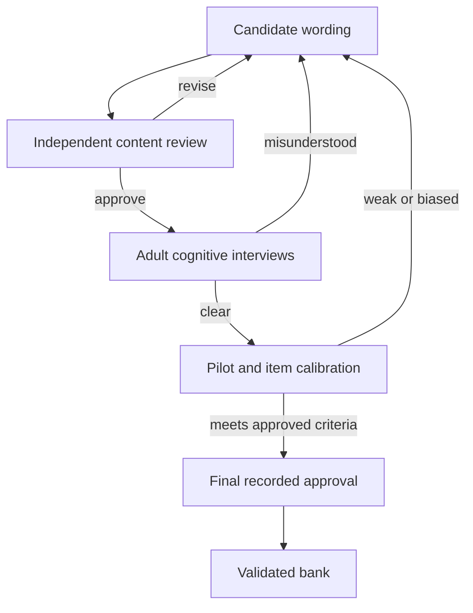

# Political literacy bank validation workflow v1

**Status:** Implemented validation gate; internal editorial pass complete; external review and human testing pending  
**Bank:** `literacy-master-2026.09-candidate-1`  
**Review:** `literacy-editorial-review-2026.09-1`  
**Audience:** English-speaking adults aged 18+  

## What this checkpoint establishes

The 80 candidates have been read individually as questions for an ordinary adult, not as political-science exam prose. The internal pass checked whether a first-time reader can understand the task, distinguish the choices, and learn from the explanation without decoding specialist language.

This is an **editorial review**, not expert, cognitive or psychometric validation. All 80 records remain `candidate`; certified selection remains blocked.

## Internal outcome

| Outcome | Count | Meaning |
|---|---:|---|
| Ready for independent content review | 79 | No blocking internal wording issue remains. This is not approval for certification. |
| Held for content expert | 1 | The political classification itself needs an independent decision before testing. |
| Validated | 0 | No candidate may enter certified play yet. |

### Wording repaired in this pass

| Item | Problem found | Correction |
|---|---|---|
| C5 | Markets and welfare made social democracy as plausible as conservatism | Added inherited institutions, gradual reform and social duty as the deciding clues. |
| C24 | “Central power” did not clearly distinguish anarchism from libertarianism or federalism | Added state rule and imposed hierarchy while retaining voluntary association and mutual aid. |
| C34 | “Fair elections” was too imprecise for the electoral-democracy classification | Replaced it with meeting basic competitive-election standards and kept liberal safeguards separate. |
| C35 | “Bosses controlling workers” was colloquial and emotionally loaded | Replaced it with private control of workplaces. |
| C37 | Yes/no choices did not grammatically answer the prompt | Turned the prompt into an explicit yes/no identification question. |
| C38 | Supporting public railways did not necessarily mean supporting public ownership | Made public ownership explicit. |
| U9 | “Support for local decisions” was too loose | Connected the wording directly to decisions kept close to communities and subsidiarity. |
| U14 | The answer gave an example but did not explain why two ideas are separate | Reframed it as two different questions: who rules and who belongs. |
| U38 | The item tested what Politangle should do | Replaced it with a reader-facing mixed-profile interpretation task. |

### Unresolved item

**C36 is held.** Its current “market-oriented anarchism” classification combines rejection of state power with strong private-property and market claims. Academic treatments acknowledge individualist/libertarian varieties but also emphasize that the boundaries and labels are disputed. An independent political-theory reviewer must choose one of three actions:

1. approve the item with a narrower label and explanation;
2. rewrite it around individualist anarchism without making strong property claims; or
3. replace it with a less disputed anarchism item.

Until then, C36 must not advance to cognitive testing.

## Duplicate-concept control

Some pairs examine the same broad distinction through different wording: `C1/C16`, `C14/C32`, `C17/C21`, `U3/U34`, and `U7/U22`.

The balanced selector now minimizes repeated primary concepts after satisfying the locked topic and difficulty quotas. Automated tests exercise 50 seeds per section and allow no more than two repeated primary concepts in a 25-question run. This is a serving safeguard, not proof that both items in each pair deserve to remain in the final bank. Independent review must still decide whether each pair provides useful parallel coverage or whether one item should be replaced.

## Required progression

### 1. Independent content review

Each question requires a reviewer who did not write the item to assess:

- whether the accepted answer is defensible from the cited evidence;
- whether another answer could reasonably be defended from the prompt;
- whether the wording treats ideologies symmetrically;
- whether distractors represent plausible misunderstandings rather than jokes or obviously false absolutes;
- whether the assigned difficulty matches the knowledge required;
- whether the concept and explanation fit Politangle’s multidimensional model; and
- whether overlap with another item is useful or wasteful.

The reviewer records `approve`, `revise`, `replace`, or `hold`, with a reason. Silence never counts as approval.

### 2. Cognitive interviews with ordinary adults

Use English-speaking adults aged 18+ with varied education levels, political familiarity and political viewpoints. For every tested item, ask the participant to:

1. read it without glossary help;
2. explain the question in their own words;
3. choose an answer and explain why;
4. identify any unfamiliar or loaded word;
5. say whether another answer also seems reasonable; and
6. explain the feedback after answering.

Record comprehension errors, hesitation, alternative interpretations and terms that require prior specialist knowledge. Do not coach the participant toward the intended answer.

### 3. Pilot and calibration

Before pilot collection, approve a written analysis plan covering at least:

- target sample and recruitment mix;
- minimum and maximum difficulty ranges;
- distractor-selection expectations;
- item discrimination rule;
- subgroup checks for education and political orientation;
- missing/abandonment handling;
- replacement and retest rules; and
- how the 23/25 threshold will be evaluated.

No numeric threshold is invented in this document. The research lead must approve those criteria before seeing the outcome data.

### 4. Final recorded approval

The code now requires a validated item to point to all three real artifacts:

- independent content-review artifact;
- cognitive-test artifact; and
- calibration artifact.

It also requires a named approval record. A content-only checklist can no longer make an item certifiable.

## Integrity controls implemented

- Every internal review entry is pinned to a fingerprint of the prompt, choices, accepted answer, explanation and evidence IDs.
- Any later content change makes the review stale and fails the test suite until re-reviewed.
- The ledger contains one and only one record for every candidate.
- An editorial pass cannot change `candidate` to `validated`.
- C36 is excluded from the external-review-ready set.
- Candidate Practice remains available; certified selection still returns `BANK_NOT_READY`.

## Next executable work

1. Obtain the independent decision on C36.
2. Give the 79-item packet to at least one independent political-theory/civic-education reviewer.
3. Apply and fingerprint approved revisions.
4. Freeze a cognitive-test bank version.
5. Run and document adult cognitive interviews.
6. Approve the calibration plan before collecting pilot outcomes.
7. Promote items only when their three evidence artifacts and final approval are recorded.

## Evidence used for the workflow

- Pew Research Center, *Writing Survey Questions*: clear wording, one idea at a time, order effects and pretesting.
- American Association for Public Opinion Research, *Best Practices for Survey Research*: simple, specific, neutral questions and pretesting.
- *Standards for Educational and Psychological Testing*: validity evidence must support the proposed interpretation and use of test scores.
- Stanford Encyclopedia of Philosophy, *Anarchism*: the tradition is diverse and united more reliably by skepticism toward justified authority and centralized hierarchy than by one settled property model.
